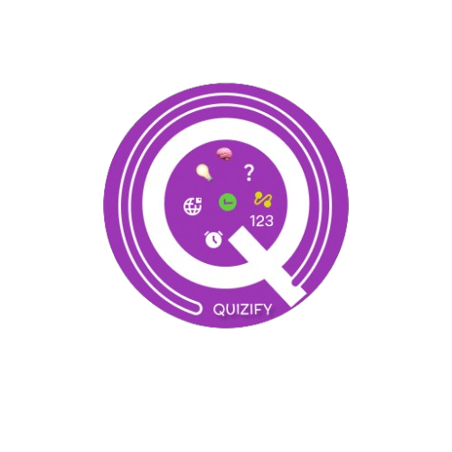

  

Take Daily Challenges such as Quiz, Sudoku and AI-powered or user-created quizzes, climb the leaderboards, and enjoy fair play. Create, share, and challenge friends while following others to discover exciting new quizzes! 🎯🏆

## ✨ Features
- 📲 **Progressive Web App (PWA):** Users can install the app to their device with a custom install prompt for a native app-like experience.
- 🔐 **User Authentication:** Users register via email, and accounts are created after verification.
- 📩 **Welcome Mail:** A welcome email is sent upon successful registration.
- 🔢 **Daily Sudoku Challenge:** Fresh puzzle every day with tracked scores, integrated into the leaderboard for extra fun and competition.
- ⚔️ **1v1 Challenge Mode:** Challenge any user to a 1v1 quiz battle on a selected topic. Win/loss/draw stats are visually displayed via a doughnut chart. Earn XP for completing quizzes, winning challenges.
- 🧠 **AI-Generated & User-Created Quizzes:** Users can take AI-generated quizzes or quizzes created by others using shared quiz codes.
- ❌ **Quiz Attempt Rules:** Users cannot retake the Daily Quiz on the same day; only one attempt is allowed.
- 🔄 **Strict Session Management Policy:**
  - **Daily Quiz (DQ):** Switching tabs more than 3 times will immediately end the quiz attempt and set the score to 0.
  - **User-Created Quizzes:** If the user switches tabs more than 2 times, the attempt will be marked as cheated. The score (regardless of correctness) will be shown to the quiz creator with a cheating flag.
- ✍️ **Quiz Creation & Sharing:** Users can create unlimited quizzes using AI or manual input and share quiz codes.
- 🏆 **Leaderboard:** Daily and overall leaderboards track top performers.
- ⏰ **Scheduling:** Leaderboard updates automatically at **12:24 AM** every day.
- 👥 **Follow Feature:** Users can follow others to keep track of their daily quizzes and scores.
- 🤖 **AI-Powered Chatbot Assistant:** A smart in-app assistant that helps users navigate the app using natural commands like "go to profile", "start today’s quiz", "go to my quizzes", etc. It guides users, offers help, and improves accessibility with real-time interaction.

## 🚀 Live Demo
- [https://quizify.azurewebsites.net/](https://quizify.azurewebsites.net/)

## 🛠 Technologies Used
- 🎨 **Frontend:** React.js, Vite, Vanilla CSS, Chart.js
- ⚙️ **Backend:** Node.js, Express.js
- 🗄 **Database:** MongoDB (Mongoose)
- 🔑 **Authentication:** Google OAuth 2.0, Local Auth, JWT
- 📧 **Email Service:** Nodemailer
- ⏳ **Scheduling:** Nodecron
- ☁️ **Image Storage:** Cloudinary
- 🧠 **AI Integration:** GroqCloud API
- 🚀 **Deployment:** Azure App Service

## 🤝 Contributing
Contributions are welcome! 
🎉 Feel free to fork the repository and submit a pull request. 💡
